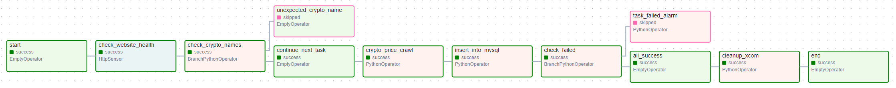

# Automate Cryptocurrency Price Crawling (using Airflow)
This project enhances **[crypto-price-crawler-crontab](https://github.com/TicyYang/crypto-price-crawler-crontab)** by using Airflow to divide the work into several tasks and combine them into a data flow.

## Environment
- Host: Ubuntu 22.04
- Python: 3.10.12
- Airflow: 2.9.1 (CeleryExecutor)
- MySQL: 8.2.0

## DAG Graph



## Files Description
```
crypto-price-crawler-airflow
├── config
│   ├── create_db_table.sql
│   ├── crypto_price_crawler_config.json
│   └── crypto_price_crawler_sql_cmd.sql
├── package
│   └── crypto_price_crawler_func.py
├── crypto_price_crawler.py
└── DAG_graph.png

```

- `create_db_table.sql`: SQL command to create the database, user, and table.
- `crypto_price_crawler_config.json`: Parameterize the variables in the DAG, and set them in Airflow Variables as JSON format.
- `crypto_price_crawler_sql_cmd.sql`: SQL command to insert the crawled data into the MySQL table.
- `crypto_price_crawler_func.py`: All functions for `PythonOperator` and `BranchPythonOperator`.
- `crypto_price_crawler.py`: Airflow DAG file.
- `DAG_graph`.png: Airflow DAG Graph.


## Before Schedule or Trigger the DAG
1. Create database and table: Use SQL command in create_db_table.sql to create the database, user, and table.
2. Settings on Airflow Web UI:
   - Connection:
     - Connection Id: `yahoo_stock`
     - Connection Type: `HTTP`
     - Host: `https://tw.stock.yahoo.com`
   - Variable:
        <table>
          <thead>
            <tr>
              <th>Key</th>
              <th>Value</th>
            </tr>
          </thead>
          <tbody>
            <tr>
              <td>crypto_price_crawler_config</td>
              <td>content of <code>crypto_price_crawler_config.json</code></td>
            </tr>
            <tr>
              <td>crypto_price_crawler_sql</td>
              <td>content of <code>crypto_price_crawler_sql_cmd.sql</code></td>
            </tr>
          </tbody>
        </table>
   - Pool:
     - Pool: `crypto_price_crawler_pool`
     - Slots: `1`

